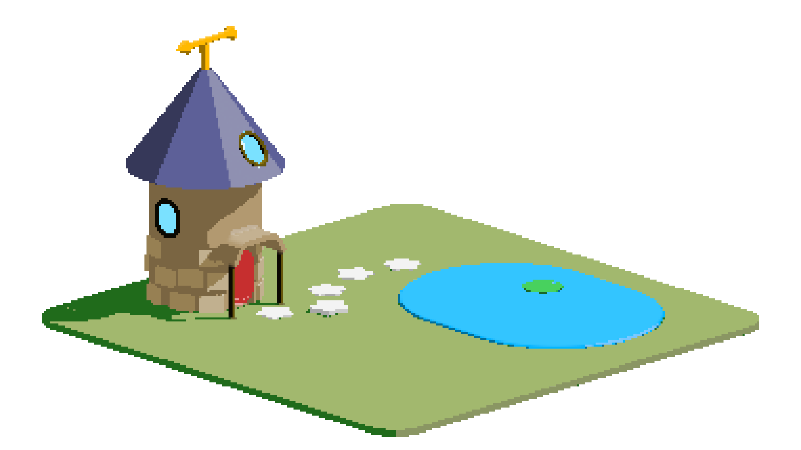

[]

Hey there

I’m Kurt, a second year Development and UX Desig student at The Open Window. I play a lot of board games and tabletop games and that comes through in my projects. I make it a goal to make each project look and feel different from each other, since I want to focus on front-end and UI, it makes sense to have a diverse set of skills.

## 📌 Pinned Repositories

 

 

 

 
 

## &#x1f4c8; GitHub Stats

 

 
 
